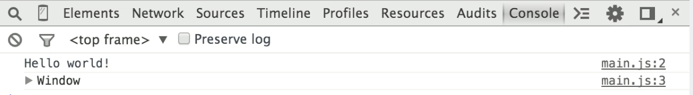

# 1. Periode Exam Preparation | Full-Stack JavaScript

###### Sources

- https://github.com/scheldejonas/fullStackJsFall2017/blob/master/period-1.md#
- https://goo.gl/WaFga7
- https://docs.google.com/document/d/1nmRhBAHlbkq9LUP0k0UlqXjqwu5-mDU_XzYzYQ_epQs/edit?usp=sharing
- https://google-developers.appspot.com/maps/documentation/utils/geojson/
- http://138.68.98.213/geoapi
- https://nodejs.org/en/download/current/
- https://code.visualstudio.com/download
- https://code.visualstudio.com/Docs/languages/javascript
- https://code.visualstudio.com/docs/getstarted/introvideos
- https://expo.io/
- https://docs.google.com/document/d/1nGvH5rrd2yhnZqnKfvgS5hBQqwhbbSVyHG31MenA7-o/edit?usp=sharing
- http://js-plaul.rhcloud.com/fsj/fsj.html#1
- http://js-plaul.rhcloud.com/node1/NodeIntro.html#1
- http://js-plaul.rhcloud.com/javascript1/js.html#1
- https://github.com/maxogden/art-of-node
- https://www.youtube.com/watch?v=GJmFG4ffJZU
- https://www.youtube.com/watch?v=8aGhZQkoFbQ
- http://js-plaul.rhcloud.com/node2/NodeGettingStarted.html#1
- https://johnpapa.net/es5-es2015-typescript/
- https://code.visualstudio.com/docs/languages/typescript
- https://www.youtube.com/watch?v=AfWYO8t7ed4
- https://www.youtube.com/watch?v=LmL0Gh193M0
- https://docs.google.com/document/d/1pkWn0_FoZuDJhGei4XlX4mx4zkZH7iuhtc6ecr5kelY/edit?usp=sharing
- https://docs.google.com/document/d/1PIMMeYPqN8Qzo4qsgjjuNAC0_15RIEVjD0DbBhcaP-0/edit?usp=sharing
- http://slides.mydemos.dk/es2015_typescript/es5VStypescript.html#1
- http://slides.mydemos.dk/webpack/webpack.html#1
- https://code.visualstudio.com/docs/languages/typescript
- https://www.typescriptlang.org/docs/home.html
- https://tutorialzine.com/2016/07/learn-typescript-in-30-minutes
- https://www.typescriptlang.org/docs/home.html
- https://docs.google.com/document/d/1Lxg0SkcKzBkARM3nzS-82xHZfqgDECJA9blTbIjaJTQ/edit?usp=sharing
- https://docs.google.com/document/d/1mfESEmM5oQfQgpSwi-pc-3Z7baiQaRDsTkLnlwLDBAM/edit
- https://webpack.js.org/

### Java & JavaScript

- Explain differences between Java and JavaScript. You should include both topics related to the fact that Java is a compiled language and JavaScript a scripted language, and general differences in language features.

First of all there is still some similarities. They are both able to do OOP, Object Oriented Programming. 

Let's then go to the differences. Java is a compiled language, which means the code needs to be compiled before it can run.

JavaScript is a scripted functional coding language, that is ready for running the minute you have the js files.

About single programs for a desktop computer javascript are only able to run in the browser or a program built on a browser engine installed on that computer. Java is able to install and run as a independent program with java client software installed.

About how the language is working, in my opinion, JavaScript's main benefit is that it can be understood by the common human. It is much easier and more robust than Java. It allows for fast creation of web page events. Many JavaScript commands are what are known as Event Handlers: They can be embedded right into existing HTML commands. JavaScript is a little more forgiving than Java. It allows more freedom in the creation of objects. Java is very rigid and requires all items to be denoted and spelled out.

- Explain the two strategies for improving JavaScript: ES6 (es2015) + ES7, versus Typescript. What does it require to use these technologies: In our backend with Node, in (many different) Browsers

TypeScript set out to solve the problems, when browser compatibility becomes the stopping problem in a particular program. The way it works is making code self explanatory through type definitions on variables. Therefore less or even maybe zero documentation is nescessary for other developers needing in future review/use of your code. Also when having to continue on your code, or even in need to use som public classes of you JavaScript code.

TypeScript then transpiles into a "All Browser" JavaScript, but with no types on as JavaScript in ES5 doesn't have it.

ES2015 offers some modern features like classes and promises, but it  falls short of fully addressing real world development concerns like avoid callbacks, debugging and error handling challenges brought upon by nested code, and still leaving developers to work with a transpiler to reach the widest audience possible. TypeScript is a remarkable piece of technology, offering a world-class integrated development experience. The free and cross-platform Visual Studio Code editor is the icing on the cake.

- Explain generally about node.js, and when it “makes sense” and npm, and how it “fits” into the node echo system.

Node.js is a JavaScript runtime built on Chrome's V8 JavaScript engine. 

Node is a runtime or environment. It is not a framework. People (I feel) often get this wrong because frameworks like express are ubiquitous with node.

Node.js is for easily building fast, scalable network applications. 

Node.js uses an event-driven, non-blocking I/O model that makes it lightweight and efficient, perfect for data-intensive real-time applications that run across distributed devices.

npm is short for Node Package Manager and is two things: first and foremost, it is an online repository for the publishing of open-source Node.js projects. Second, it is a command-line utility for interacting with said repository that aids in package installation, version management, and dependency management.

- Explain about the Event Loop in Node.js

First about the event loop in javascript: The Event Loop is a queue of callback functions. When an async function executes, the callback function is pushed into the queue. The JavaScript engine doesn't start processing the event loop until the code after an async function has executed.

Node.js - Event Loop: Node.js is a single-threaded application, but it can support concurrency via the concept of event and callbacks. Every API of Node.js is asynchronous and being single-threaded, they use async function calls to maintain concurrency. Node uses observer pattern.

So Node.js is an asynchronous platform. It doesn't wait around for things like file I/O to finish - Node.js uses callbacks. 
Just to explain: A callback is a function called at the completion of a given task; this prevents any blocking, and allows other code to be run in the meantime.

- Explain (some) of the purposes with the tools Babel and WebPack, using  examples from the exercises

First i'll explain what webpack is:
webpack is a module bundler. webpack takes modules with dependencies and generates static assets representing those modules.

Babel is a transpiler to transpile your ES6 code to ES5 code in either CommonJS, AMD, or UMD format. Then it pipes the transpiled code through a module bundler ex. Webpack to create one or more bundled files.

- Explain the purpose of “use strict” and also Linters, exemplified with ESLint

Firstly, what is it for? The JavaScript strict mode is a feature in ECMAScript 5. You can enable the strict mode by declaring this in the top of your script/function: "  'use strict'  ". 
When a JavaScript engine sees this directive, it will start to interpret the code in a special mode.

Before we understand ESLint, let's firstly understand linters.
It is in general computer programming, that lint is a Unix utility for flagging some suspicious and non-portable constructs (likely to be bugs) in C language source code.
Generically, lint or a linter is any tool that flags suspicious usage in software written in any computer language. So also explained as code linting is a type of static analysis that is frequently used to find problematic patterns or code that doesn't adhere to certain style guidelines.

So what is ESLint and what is the purpose more specific with ESLint?
ESLint is an open source JavaScript linting utility originally created by Nicholas C. Zakas in June 2013.

### JavaScript features

- Variable hoisting

What is hoisting in JavaScript? Hoisting is the JavaScript interpreter's action of moving all variable and function declarations to the top of the current scope. However, only the actual declarations are hoisted. Any assignments are left where they are.

Variable declarations are one of the most basic aspects of any programming language. However, JavaScript has a little quirk, known as *hoisting*, which can turn an innocent looking declaration into a subtle bug. 

JavaScript is an extremely flexible language, and will happily allow you to declare a variable almost anywhere. For example, the following immediately-invoked function expression (IIFE) declares three variables and then displays them using an alert dialog box. As a side note, you should never use alert boxes, but i'm trying to prove a point.

```javascript
(function() {
  var foo = 1;
  var bar = 2;
  var baz = 3;

  alert(foo + " " + bar + " " + baz);
})();
```

This looks like sane JavaScript code. As expected, it displays the string `"1 2 3"`. Now, assume that the alert is moved, as shown below.

```javascript
(function() {
  var foo = 1;
  alert(foo + " " + bar + " " + baz);
  var bar = 2;
  var baz = 3;
})();
```

If someone actually wrote this code, it was probably by mistake. Clearly, the alert takes place before `bar` and `baz` are declared. However, this is perfectly valid JavaScript, which does not generate an exception. Instead, the alert displays `"1 undefined undefined"`.

Based on our previous experiment, it seems that you can reference variables that don’t exist yet. Now, let’s take the same IIFE, but remove the `baz` declaration altogether, as shown below. Suddenly, we have a `ReferenceError` because `baz` is not defined.

```javascript
(function() {
  var foo = 1;
  alert(foo + " " + bar + " " + baz);
  var bar = 2;
})();
```

This is truly interesting behavior. To understand what’s going on here, you have to understand hoisting. Hoisting is the JavaScript interpreter’s action of moving all variable and function declarations to the top of the current scope. However, only the actual declarations are hoisted. Any assignments are left where they are. Therefore, our second example IIFE actually translates to the following code.

```javascript
(function() {
  var foo;
  var bar;
  var baz;

  foo = 1;
  alert(foo + " " + bar + " " + baz);
  bar = 2;
  baz = 3;
})();
```

Now it makes sense why the second example didn’t generate an exception. After hoisting, `bar` and `baz` are actually declared before the alert statement, albeit with undefined values. In the third example, `baz` was removed completely. Therefore, there was nothing to hoist, and the alert statement resulted in an exception.

- Function Hoisting

As previously mentioned, function declarations are also hoisted. However, functions that are assigned to variables are not hoisted. For example, the following code will work as expected due to function declaration hoisting.

```javascript
foo();

function foo() {
  alert("Hello!");
}
```

However, the following example will fail spectacularly. The variable declaration for `foo`is hoisted before the function call. However, since the assignment to `foo` is not hoisted, an exception is thrown for trying to call a non-function variable.

```javascript
foo();

var foo = function() {
  alert("Hello!");
};
```


- ``this`` in JavaScript and how it differs from what we know from Java/.net.

JavaScript has a special keyword to give access to a specific context. The, this keyword can be used to access values, methods, and other objects on a context specific basis. Meaning, ``this`` changes based on where it is used.

There is 4 ways this can take a value.

1. In normal function calls
2. Within methods on objects
3. Within an object that has been constructed
4. A function invoked with .call, .apply, or bind

Examples for the first three ways showed:

##### In normal function call

```javascript
function helloWorld() {
    console.log("Hello world!");
  	console.log(this);
};

helloWorld();
```

This example give us this in the browser console:



##### Within method on object

```javascript
var Portland = {
  bridges: 12,
  airport: 1,
  soccerTeams: 1,
  logNumberOfBridges: function() {
    console.log("There are " + this.bridges + " bridges in Portland!");
  }
}

Portland.logNumberOfBridges();
```

This example give us this in the browser console:


##### Within an object that has been contructed

```javascript
var Portland = {
  bridges: 12,
  airport: 1,
  soccerTeams: 1,
  logNumberOfBridges: function() {
    console.log("There are " + this.bridges + " bridges in Portland!");
  }
}

function logTeams () {
    console.log(this.soccerTeams);
}

Portland.foo = logTeams;

Portland.foo();
```

This example give us this in the browser console:


``this`` in javascript

So if we for example would have written ```logTeams()``` instead of ```Portland.foo()``` we would have gotten an ```undefined``` answer instead of ```1```. because the callable function is not attached or in other words referenced to the right context.

So to make the code inside of ```logTeams()``` work, it has to be in a context (example the Portland object) where a ```soccerTeams``` key-value pair variable is defined.

- Function Closures and the JavaScript Module Pattern

A closure is one way of supporting first-class functions. It is an expression that can reference variables within its scope (when it was first declared), be assigned to a variable, be passed as an argument to a function, or be returned as a function result.

Read below along in the comments, of what happens, and what function closure is:

```javascript
// Clouser example of the simple way it works
console.log('\nTest case of Closure simple explained');
function celebrityName (firstName) {
    var nameIntro = "This celebrity is ";
    // this inner function has access to the outer function's variables, including the parameter
   function lastName (theLastName) {
        return nameIntro + firstName + " " + theLastName;
    }
    return lastName;
}
var mjName = celebrityName ("Michael"); // At this juncture, the celebrityName outer function has returned.

// The closure (lastName) is called here after the outer function has returned above
// Yet, the closure still has access to the outer function's variables and parameter
console.log('Firstname is already set before this function call: ' + mjName ("Jackson")); // This celebrity is Michael Jackson

// Closure used to store outer functions variables for later invocations needs
console.log('\nTest case of Closure with later acces for outer functions variables, because of the need for later inner function invocation');
function celebrityID () {
    var celebrityID = 999;
    // We are returning an object with some inner functions
    // All the inner functions have access to the outer function's variables
    return {
        getID: function ()  {
            // This inner function will return the UPDATED celebrityID variable
            // It will return the current value of celebrityID, even after the changeTheID function changes it
          return celebrityID;
        },
        setID: function (theNewID)  {
            // This inner function will change the outer function's variable anytime
            celebrityID = theNewID;
        }
    }
}
var mjID = celebrityID (); // At this juncture, the celebrityID outer function has returned.
console.log('Before setID is called: ' + mjID.getID()); // 999
mjID.setID(567); // Changes the outer function's variable
console.log('After setID is called: ' + mjID.getID()); // 567: It returns the updated celebrityId variable

// Closure gone wrong
console.log('\nTest case of Clouse gone wrong');
function celebrityIDCreator1 (theCelebrities) {
    var i;
    var uniqueID = 100;
    for (i = 0; i < theCelebrities.length; i++) {
      theCelebrities[i]["id"] = function()  {
        return uniqueID + i; //the i var is then wrongly later being used on id(), but it will
      }
    }
    return theCelebrities;
}
var actionCelebs = [{name:"Stallone", id:0}, {name:"Cruise", id:0}, {name:"Willis", id:0}];
var createIdForActionCelebs = celebrityIDCreator1 (actionCelebs);
var stalloneID = createIdForActionCelebs[0];
console.log('Stallone ID: ' + stalloneID.id()); // 103 (wrong)
console.log('Cruise ID: ' + createIdForActionCelebs[1].id()); // 103 (wrong)
```

Result from the console:


So now we see in the lowest example, that function closure can also be a problem.

To solve this, with the intact setup, we use an IIFE, shown below here:


- Immediately-Invoked Function Expressions (IIFE)

The IIFE starts on line 7 to 9.

```javascript
// The solution to closure gone wrong above
console.log('\nTest case of wrongly closure solved with IIFE - Immediatly invoked function expression');
function celebrityIDCreator (theCelebrities) {
    var i;
    var uniqueID = 100;
    for (i = 0; i < theCelebrities.length; i++) {
        theCelebrities[i]["id"] = function (j)  { // the j parametric variable is the i passed in on invocation of this IIFE
            return uniqueID + j; // each iteration of the for loop passes the current value of i into this IIFE and it saves the correct value to the array
        } (i); // immediately invoke the function passing the i variable as a parameter
    }
    return theCelebrities;
}
var actionCelebs = [{name:"Stallone", id:0}, {name:"Cruise", id:0}, {name:"Willis", id:0}];
var createIdForActionCelebs = celebrityIDCreator (actionCelebs);
var stalloneID = createIdForActionCelebs [0];
console.log('Stallone ID: ' + stalloneID.id); // 100
var cruiseID = createIdForActionCelebs [1];
console.log('Cruise ID: ' + cruiseID.id); // 101
```

The console gives us then this:


- JavaScripts Prototype

Prototype is a property on a function. Every function has by default the empty 'prototype' property.

Also, just to inform, there is a property in some browsers: Firefox, Safari and Chrome have a pseudo property called ```__proto__```. We will properly never use it, but it is there as an alternativ to the pure javascript prototype property.

The code below explains in the comments:

```javascript
function PrintStuff (myDocuments) {
    this.documents = myDocuments;
}

// We add the print () method to PrintStuff prototype property so that other instances (objects) can inherit it:
PrintStuff.prototype.print = function () {
    console.log(this.documents);
}

// Create a new object with the PrintStuff () constructor, thus allowing this new object to inherit PrintStuff's properties and methods.
var newObj = new PrintStuff ("I am a new Object and I can print.");

// newObj inherited all the properties and methods, including the print method, from the PrintStuff function. Now newObj can call print directly, even though we never created a print () method on it.
newObj.print(); //I am a new Object and I can print.
```

The console then prints this:

###### 

So it is basicly used to create inheritance. That means objects, which inherits functions created on a function or and object.

- User defined Callback Functions

The user defined callback functions has some different understanding to it. It works as a function passed on like an object. so the function the uses your callback function passed as parameter to the function you are running, can then use the variables because of closure, in the function running the called back function, this is where the name comes from. Then issues on the variable thing, I have previously described more above in the IIFE as the solution to where outer scope variables is used inside the called back function wrongly.

To display in simple way what is a callback (called back) function, I have made this example:

```javascript
// global variable
var allUserData = [];

// generic logStuff function that prints to console
function logStuff (userData) {
    if ( typeof userData === "string")
    {
        console.log(userData);
    }
    else if ( typeof userData === "object")
    {
        for (var item in userData) {
            console.log(item + ": " + userData[item]);
        }
    }
}

// A function that takes two parameters, the last one a callback function
function getInput (options, callback) {
    allUserData.push (options);
    callback (options);
}

// When we call the getInput function, we pass logStuff as a parameter.
// So logStuff will be the function that will called back (or executed) inside the getInput function
getInput ({name:"Rich", speciality:"JavaScript"}, logStuff);
//  name: Rich
// speciality: JavaScript
```

This is then what the console is giving us:


The callback inside getInput is there the example of the callback being ran with the logStuff function.

But

There is some issues, using functions (or also rightly called methods) called back from an object (example setUsername method inside the object literal)

The problem arise in the code like this:

```javascript
// Define an object with some properties and a method
// We will later pass the method as a callback function to another function
var clientData = {
    id: 094545,
    fullName: "Not Set",
    // setUserName is a method on the clientData object
    setUserName: function (firstName, lastName)  {
        // this refers to the fullName property in this object
      this.fullName = firstName + " " + lastName;
    }
}

function getUserInput(firstName, lastName, callback)  {
    // Do other stuff to validate firstName/lastName here for example

    // Now save the names
    callback (firstName, lastName);
}

getUserInput ("Barack", "Obama", clientData.setUserName);

console.log (clientData.fullName);// Not Set

// The fullName property was initialized on the window object
console.log (window.fullName); // Barack Obama
```

The console then logs this:


The problem is the var clientData key inside its object literal, is not the scope, the callback function is fired inside, and therefore not directly accessable in the callback functions outer scope.

```javascript
// Define an object with some properties and a method
// We will later pass the method as a callback function to another function
var clientData = {
    id: 094545,
    fullName: "Not Set",
    // setUserName is a method on the clientData object
    setUserName: function (firstName, lastName)  {
        // this refers to the fullName property in this object
      this.fullName = firstName + " " + lastName;
    }
}

//Note that we have added an extra parameter for the callback object, called "callbackObj"
function getUserInput(firstName, lastName, callback, callbackObj)  {
    // Do other stuff to validate firstName/lastName here for example
  
    // The use of the Apply function below will set the this object to be callbackObj
    callback.apply (callbackObj, [firstName, lastName]);
}

// We pass the clientData.setUserName method and the clientData object as parameters. The clientData object will be used by the Apply function to set the this object
getUserInput ("Barack", "Obama", clientData.setUserName, clientData);

// the fullName property on the clientData was correctly set
console.log (clientData.fullName); // Barack Obama
```

This is then what comes out of the console:


And that's how to do.

In the finals multiple callbacks can then just be reused into simple separated code like this example:

```javascript
function successCallback() {
    // Do stuff before send
}

function successCallback() {
    // Do stuff if success message received
}

function completeCallback() {
    // Do stuff upon completion
}

function errorCallback() {
    // Do stuff if error received
}

$.ajax({
    url:"http://fiddle.jshell.net/favicon.png",
    success:successCallback,
    complete:completeCallback,
    error:errorCallback
});
```

And it goes on with places to use your callback functions as you please.


- Explain the methods map, filter and reduce

These three methods is used as functional approaches, to either filter out an array, to a new array with less filtered results in it, to populate a new array with a given array, or sum up the content of the array into on result.

##### Filter

This filters out the array by you writing an true or false answer to if the iterated element should return into the new array being made.

It works like this:

```javascript
// Giving an array to be filtered
var array = ['California','Portland','Florida', 'New Jersey'];
console.log(array);

var uniqueArray = array.filter(function(elem, index, array) {
        if (elem === 'California') {
            return false;
        }
        return array.indexOf(elem) === index;
    }
);

console.log(uniqueArray);

// ES6
// array.filter((elem, index, arr) => arr.indexOf(elem) === index);
```

This then comes out in the console:


So California is filtered out.

##### Map

This is to populate the existing array into a new array with same length, but with different values per element.

Looking like this:

```javascript
// Map function displayer
console.log('Map function used');
var fahrenheit = [0, 32, 45, 50, 75, 80, 99, 120];
console.log(fahrenheit);

var celcius = fahrenheit.map(function(elem) {
    return Math.round((elem - 32) * 5 / 9);
}); 
// ES6
// fahrenheit.map(elem => Math.round((elem - 32) * 5 / 9));

console.log(celcius) //  [-18, 0, 7, 10, 24, 27, 37, 49]
```

This then is coming out in the console:


So fahrenheit is turned into celcious

**Reduce**

This is to reduce the whole array into one value or one string, that can be used for later statistics for example of the data in the array. I'll display it instead:

```javascript
// Reduce function displayed
console.log('Reduce function used');
var rockets = [
    { country:'Russia', launches:32 },
    { country:'US', launches:23 },
    { country:'China', launches:16 },
    { country:'Europe(ESA)', launches:7 },
    { country:'India', launches:4 },
    { country:'Japan', launches:3 }
];
console.log(rockets);

var sum = rockets.reduce(function(prevVal, elem) {
    return prevVal + elem.launches;
}, 0);
// ES6
// rockets.reduce((prevVal, elem) => prevVal + elem.launches, 0); 

console.log(sum); // 85
```

This is then displayed in the console


So all the launches is added together to see the total number of launches. Easy !


- Provide examples of user defined reusable modules implemented in Node.js

User defined reusable modules, is the way to make code snippets or "classes alike in java", to have it all possible for requiring in other code files.

The way it works is a little different from client-side to server-side, where node.js (The leading server side javascript environment) is used.

On node.js you can then make modules:

```javascript
var customerStore = require('store/customer');
var when = require('when');

module.exports = function (id) {
    return when(id).then(customerStore.load);
};
```

There is three keywords, you need to notice:

- require = gets a module / The `require` function imports other modules' exports by their module ids. 
- exports = defines what to send, when something is requiring / In CommonJS, a module exports values by assigning those values to properties on the `exports` object
- module = The object in Node where modules are happening / The `module` object provides meta-data about the current module, such as its id and uri.

### ES6-7 and TypeScript

- Provide examples and explain the es2015 features: let, arrow functions, this, rest parameters, de-structuring assignments, maps/sets etc.

**`const`** is a signal that the identifier won’t be reassigned.

**`let`,** is a signal that the variable may be reassigned, such as a counter in a loop, or a value swap in an algorithm. It also signals that the variable will be used only in the block it’s defined in, which is not always the entire containing function.

**`var`** is now the weakest signal available when you define a variable in JavaScript. The variable may or may not be reassigned, and the variable may or may not be used for an entire function, or just for the purpose of a block or loop.

I don't think there is need for showing examples for const, let and var. Instead i want to tell that something to be knowing on hoisting on let's.

```javascript
function foo () {
  typeof bar;
  let bar = ‘baz’;
}
foo(); // ReferenceError: can't access lexical declaration
       // `bar' before initialization
```

##### Arrow functions

Also called “fat arrow” functions, from CoffeeScript ([a transcompiled language](http://blogs.msdn.com/b/cdnstudents/archive/2013/09/17/visual-studio-tips-for-javascript-coders-try-coffeescript.aspx?WT.mc_id=16547-DEV-sitepoint-article83)) are a more concise syntax for writing function expressions. They utilize a new token, `=>`, that looks like a fat arrow. Arrow functions are anonymous and change the way `this` binds in functions.

```javascript
// Basic use of arrow function
var multiply = (x, y) => x*y;
console.log(multiply(2,3)); // 6

// If no parameters parenteses has to be present
var document = 'The called back function as arrow function';
var docLogEs6 = () => { console.log(document); }
docLogEs6(); // > The called back function as arrow function

// Object literal example
var setNameIdsEs6 = (id, name) => ({id: id, name: name });
(setNameIdsEs6 (4, 'Kyle')); //Object {id: 4, name: "Kyle"};
```

##### This

``this`` keyword works different in arrow functions.

As was mentioned previously, the `this` keyword works differently in arrow functions. The methods [call(), apply(), and bind()](http://javascriptissexy.com/javascript-apply-call-and-bind-methods-are-essential-for-javascript-professionals/) will not change the value of `this` in arrow functions. (In fact, the value of `this` inside of a function simply can’t be changed–it will be the same value as when the function was called.) If you need to bind to a different value, you’ll need to use a function expression.

##### This and Constructors

Arrow functions cannot be used as [constructors](https://msdn.microsoft.com/en-us/library/c1hcx253(v=vs.94).aspx?WT.mc_id=16547-DEV-sitepoint-article83) as other functions can. Don’t use them to create similar objects as you would with other functions. If you attempt to use `new` with an arrow function, it will throw an error. Arrow functions, like [built-in functions](https://msdn.microsoft.com/en-us/library/c6hac83s(v=vs.94)?WT.mc_id=16547-DEV-sitepoint-article83) (aka methods), don’t have a prototype property or other internal methods. Because constructors are generally used to create classlike objects in JavaScript, you should use the new [ES6 classes](https://blogs.msdn.microsoft.com/ie/2014/12/15/classes-in-javascript-exploring-the-implementation-in-chakra/?WT.mc_id=16547-DEV-sitepoint-article83) instead.

##### This and Generators

Arrow functions are designed to be lightweight and cannot be used as [generators](https://msdn.microsoft.com/en-us/library/dn858237(v=vs.94).aspx?WT.mc_id=16547-DEV-sitepoint-article83). Using the `yield` keyword in ES6 will throw an error. Use [ES6 generators](https://davidwalsh.name/es6-generators) instead.

##### This and Arguments object

Arrow functions do not have the local variable `arguments` as do other functions. The arguments object is an array-like object that allows developers to dynamically discover and access a function’s arguments. This is helpful because JavaScript functions can take an unlimited number of arguments. Arrow functions do not have this object.

##### Rest parameters

So, when using spread, you are expanding a single variable into more:

```javascript
	var abc = ['a', 'b', 'c'];
var def = ['d', 'e', 'f'];
var alpha = [ ...abc, ...def ];
// alpha == ['a', 'b', 'c', 'd', 'e', 'f'];
```

But, when using rest parameter, you are gathering all remaining parameters into one array:

```javascript
function sum( first, ...others ) {
    for ( var i = 0; i < others.length; i++ )
        first += others[i];
    return first;
}
// sum(1, 2, 3, 4) == 10;
```

So 2,3,4 is inside others, and then becomes a loopable array to get the sum of in this function.

##### Destructing assignments

Destructuring is a convenient way to extract properties from objects into variables.

Basic syntax:

```javascript
let person = {
  name: 'Bob',
  age: 25
};

let { name, age } = person;

// Is equivalent to
let name = person.name; // 'Bob'
let age = person.age;   // 25
```

Destructuring and renaming:

```javascript
let person = {
  name: 'Bob',
  age: 25
};

let { name: firstName } = person;

// Is equivalent to
let firstName = person.name; // 'Bob'
```

Destructuring with default values:

```javascript
let person = {
  name: 'Bob',
  age: 25
};

let { phone = '123-456-789' } = person;

// Is equivalent to
let phone = person.hasOwnProperty('phone') ? person.phone : '123-456-789'; // '123-456-789'
```

Destructuring and renaming with default values

```javascript
let person = {
  name: 'Bob',
  age: 25
};

let { phone: p = '123-456-789' } = person;

// Is equivalent to
let p = person.hasOwnProperty('phone') ? person.phone : '123-456-789'; // '123-456-789'
```

##### maps/sets

`new Map()` objects, is iteratble objects, that has key, value pairs, it also means that the keys is unique, showed here below:

```javascript
var array = [1, 2, 3, 3];

var set = new Set(array); // Will have [1, 2, 3]
assert(set.size, 3);

var map = new Map();
map.set('a', 1);
map.set('b', 2);
map.set('c', 3);
map.set('C', 3);
map.set('a', 4); // Has: a, 4; b, 2; c: 3, C: 3
assert(map.size, 4);
```

And also displayed here over, the Set is then slightly different, it is not necessarily a iteratable object, it is a set of unique values and that's just it about Set in basics.

- Explain and demonstrate how es2015 supports modules (import and export) similar to what is offered by NodeJS.

ES6 (es2015) modules showed:

```javascript
import { load } from 'store/customer';
import when from 'when';

export default = function (id) {
    return when(id).then(load);
};
```

ECMAScript 6 (ES6) modules use the reserved keywords `export` and `import`.

The `export` keyword instructs the environment that a variable is to be exported. It also declares the variable locally exactly like a `let` statement would.

`import` binds one or more exported variables from another module into the current module's scope. The bound variables are listed inside curly braces and the other module's id must be quoted.

- Provide an example of ES6 inheritance and reflect over the differences between Inheritance in Java and in ES6.

To make use of inheritance in JavaScript, it is made possible through ES6 in normal ways of writing inheritance, like in java. I will explain here below:

But the ECMAScript 6 alternative is better:

```javascript
var legsCountSymbol = Symbol();
class InsectES6 extends AnimalES6 {
    constructor(name) {
        super(name);
        this[legsCountSymbol] = 0;
    }

    get legsCount() {
        return this[legsCountSymbol];
    }

    set legsCount(value) {
        if (value < 0) {
            console.log("We do not support nether or interstellar insects");
        }

        this[legsCountSymbol] = value;
    }

    doSomething() {
        super.doSomething();
        console.log("And I have " + this[legsCountSymbol] + " legs!");
    }
}

var spiderES6 = new InsectES6("Spider");
spiderES6.legsCount = 8;
spiderES6.doSomething();
```

Thanks to the `extends` keyword you can specialize a class into a child class while keeping reference to the root class with the `super` keyword.

The difference to java is the quite close or close to no real difference in typing understanding. extends is the same, get'ers and set'ers is basicly the same methods is the same, constructors is the same syntax basically. So the difference is lovely almost nothing in ES6. And thanks to Babel, it makes it possible to code in ES6, and get the running site out to all browsers anyway.

- Provide examples with es6, running in a browser, using Babel and Webpack.

Purpose of Babel, would be to transpile our newer versioned javascript code, into older versioned JS code for all browsers availability to support our application.

Purpose of Webpack is to be our JS library manager also known as a module bundler.

But it can also be used for tasks as well. Webpack relies on loaders and plugins. 

For example, if we need to try start and run a javascript client set with webpack and babel, it would look like this:

```bash
npm install babel-core babel-loader babel-preset-es2015 webpack --save-dev
```

Then, to make our first app js file be transpiled into ES5, we would need a webpack config file like this called webpack.config.js

```javascript
 var path = require('path');
 var webpack = require('webpack');
 module.exports = {
     entry: './js/app.js',
     output: {
         path: path.resolve(__dirname, 'build'),
         filename: 'app.bundle.js'
     },
     module: {
         loaders: [
             {
                 test: /\.js$/,
                 loader: 'babel-loader',
                 query: {
                     presets: ['es2015']
                 }
             }
         ]
     },
     stats: {
         colors: true
     },
     devtool: 'source-map'
 };
```

To start the transpiring, we would need to make a scripts file, called package.json

```javascript
"scripts": {
    "webpack": "webpack",
    "start": "http-server"
},
```

Then we go create an empty folder called build.

After this open the terminal and run this

```bash
npm run webpack
```

The an new transpiled js file appears in the build folder. To load this, you need to go to you index.html file and insert the load line.

```html
<script src="build/app.bundle.js"></script>
```

The full code is found [here](/Period%201/exam-preparation/webpack-babel-example/)

- Provide an number of examples to demonstrate the benefits of using TypeScript, including, types, interfaces, classes and generics.

