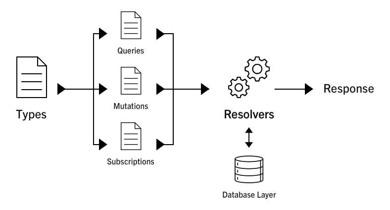

# <u>Period 3 - Exam Preparation</u>

###### Interesting Quotes of the day:

<u>The trick to maintaining your sanity in these fast-moving times is to learn new stuff right between stages two and three, once your interest is piqued but while you’re still ahead of the curve.</u>

<u>Which is why now is the perfect time to learn what exactly this GraphQL thing you keep hearing about really is.</u>

###### Sources

- <u>https://docs.google.com/document/d/12Ri_Kt8J7a0wNBwbhVnR-jbH9ENAS0EMrfTeGmxsNhQ/edit</u>
- <u>http://graphql.org/learn/</u>
- <u>https://www.youtube.com/watch?v=_9RgHXqH8J0</u>
- <u>http://graphql.org/learn/schema/</u>
- <u>https://www.howtographql.com</u>
- <u>http://graphql.org/graphql-js/</u>
- <u>https://www.howtographql.com/react-apollo/0-introduction/</u>
- https://github.com/CphbusFall2017FullStackJS/hackernews

### GraphQL overview

- **Explain shortly about GraphQL, it purpose and some of it’s use cases**

<u>GraphQL's purpose is to be a query language for your API, and a server-side runtime for executing queries by using a type system you define for your data. GraphQL isn't tied to any specific database or storage engine and is instead backed by your existing code and data.</u>

GraphQL is used together with you JavaScript Express backend server, on the REST API. Your are here able to have one endpoint, that then serves all data fetching.

GraphQL is implemented in so many languages, with libraries for frameworks to those languages already.

The list goes on here: [List of languages to GraphQL](http://graphql.org/code/) 

- **Explain some of the Server Architectures that can be implemented with a GraphQL backend**
  **What is meant by the terms over- and under fetching in relation to REST**

The way it can be setup is 3 different kinds of achitectures:

1. GraphQL server *with a connected database*
2. GraphQL server that is a *thin layer in front of a number of third party or legacy systems* and integrates them through a single GraphQL API
3. A *hybrid approach of a connected database and third party or legacy systems* that can all be accessed through the same GraphQL API

<u>Over- and underfetching is meant to tell, you are spending queries on getting to much data, for the specific client call.</u>

<u>It can have the problem of being to little data, and you then are calling again to get the corresponding data to the view the client is requesting.</u>

It can have the problem of the database query needing to gather to much complex data structures or filters upon the query, when over fetching.

- **Explain shortly about GraphQL’s type system and some of the benefits we get from this**

<u>In basics, it is all about selecting fields on objects to be queried.</u>

[Type System Examples](/Periode%203/graphql-examples.md#type-system)

Out benefits is the writting of query gets pretty readable. 

- **Explain shortly about GraphQL Schema Definition Language, and provide an number of examples of schemas you have defined.**

<u>A Schema definition is to make queries understandable for GraphQL, and they have support for the most concepts.</u>

<u>I have provided the examples of different ways to setup the Schema.</u>

[Schema System Examples](/Periode%203/graphql-examples.md#schema-system)

### GraphQL with React + Apollo

- **Provide a number of examples demonstrating data fetching with GraphQL. You should provide examples both running in a Sandbox/playground and examples executed in an Apollo Client**

Here is an example from the [playground](https://graphqlbin.com/7qgCz).

Here is extracted [Query Apollo Client example](/Period%203/graphql-examples.md#apollo-client) from the `courses-react-app` project

- **Provide a number of examples demonstrating creating, updating and deleting with Mutations. You should provide examples both running in a Sandbox/playground and examples executed in an Apollo Client.**

Here is an example from the [playground](https://www.graphqlbin.com/mWKF6).

Here is extracted [Mutation Apollo Client Example](/Period%203/graphql-examples.md#apollo-client) from the `courses-react-app` project.

- **Explain the Concept of a Resolver function, and provide a number of simple example of resolvers you have implemented in a GraphQL Server.**

Resolvers, is by word standing for solving what to do with the query or mutation being sent to your the GraphQL api.

[Resolver examples](Period%203/graphql-examples.md#resolvers)

Many GraphQL libraries will let you omit resolvers this simple and will just assume that if a resolver isn't provided for a field, that a property of the same name should be read and returned.

That means in the overview it looks like:

### GraphQL with Graphcool

- **Explain about graphCool and how it fits into the GraphQL world**

It is a open-source framework to develop and deploy production-ready serverless GraphQL backends. Including GraphQL database mapping, real-time subscriptions & flexible permission system.

You can also get total out of the hasle with backend and create an account in the managed GrapQL Backend Hosting service at Graphcool [here](https://console.graph.cool/signup).

- **Demonstrate queries up against a graphCool backend, both via a React/Apollo Client, and from “alternative” clients like a plain node backend and/or Postman.**

An example of Graphcool connected to an React application with Apollo Client [here](/Period%203/graphql-examples.md#graphcool-with-reactapollo-client)

An example of Graphcool from Postman/Insomnia [here](/Period%203/graphql-examples.md#graphcool-with-postman-or-insomnia).

- **In an apollo based React Component, demonstrate what is used to to parse the plain GraphQL queries?**

To parse it, an JavaScript Template Literal is used.

It works the same way as in Java with String.format("Text %s", "Joe"); = Text Joe.

This is an example of an parsed plain GrapQL query [here](/Period%203/graphql-examples.md#apollo-client) (line 4 -13)

- **In an apollo based React Component, demonstrate where/how a query is injected into the  props of the query, and how the props value gets its name.**

You do that through giving the (arrow) callback function on props for graphql query options with variables.

This is an example of getting an course by id [here](/Period%203/graphql-examples.md#apollo-client) (line 15-21 and  1-7 in second code snippet).

- **Demonstrate a demo Apollo/React - client and point out important things necessary to work with this technology**

The important things to understand when working with GraphQL Client side is:

- Get into good connection with the GraphQL setup, so your data doesn't get compromised through important mutations that didn't got checked by authentication.
- Your state management is still needed through MobX or Redux, it is not handled by ApolloProvider. It is just a library to communicate with your backend in the React app.
- Use it as the technology bridge it is in front of your Legacy database, thirdparty REST calls or more when setting up your backend.
- When having more the one task for the query in same flow, use the option to compose queries, so that network load is kept down, as intended through no more over- and under fetching. Here is an example of a composed query - [Composed query]()