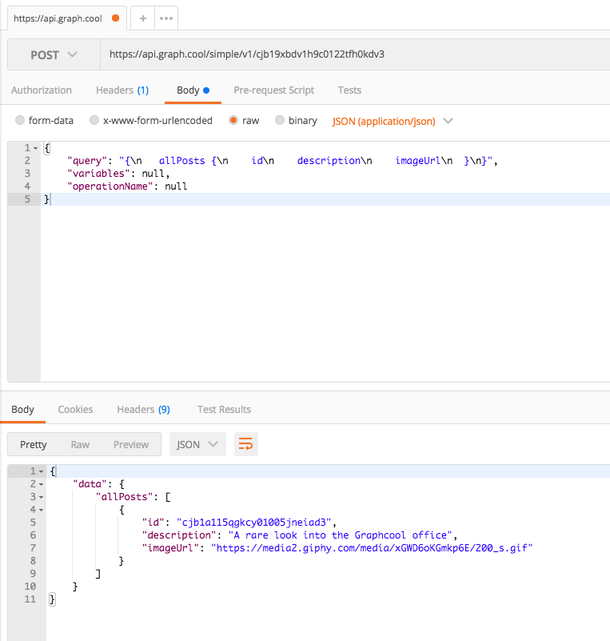
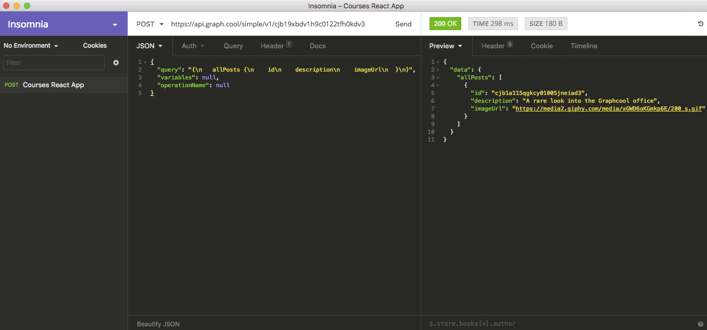

# GraphQL  - Examples

[< Go back to main](/Period%203/README.md)


### Type system (Query example)

```javascript
{
  hero {
    name
    appearsIn
  }
}
```

The outer {} is the root of the backend

`hero` is the object

`name, appearIn` is fields in the hero object.

Returns

```javascript
{
  "data": {
    "hero": {
      "name": "R2-D2",
      "appearsIn": [
        "NEWHOPE",
        "EMPIRE",
        "JEDI"
      ]
    }
  }
}
```


### Schema system

```javascript
type Character {
  name: String!
  appearsIn: [Episode]!
}
```

- `Character` is a *GraphQL Object Type*, meaning it's a type with some fields. Most of the types in your schema will be object types.
- `name` and `appearsIn` are *fields* on the `Character` type. That means that `name` and `appearsIn` are the only fields that can appear in any part of a GraphQL query that operates on the `Character` type.
- `String` is one of the built-in *scalar* types - these are types that resolve to a single scalar object, and can't have sub-selections in the query. We'll go over scalar types more later.
- `String!` means that the field is *non-nullable*, meaning that the GraphQL service promises to always give you a value when you query this field. In the type language, we'll represent those with an exclamation mark.
- `[Episode]!` represents an *array* of `Episode` objects. Since it is also *non-nullable*, you can always expect an array (with zero or more items) when you query the `appearsIn`field.

Arguments

```javascript
type Starship {
  id: ID!
  name: String!
  length(unit: LengthUnit = METER): Float
}
```


Enum type

```javascript
enum Episode {
  NEWHOPE
  EMPIRE
  JEDI
}
```

Scalar types:

- `Int`: A signed 32‐bit integer.
- `Float`: A signed double-precision floating-point value.
- `String`: A UTF‐8 character sequence.
- `Boolean`: `true` or `false`.
- `ID`: The ID scalar type represents a unique identifier, often used to refetch an object or as the key for a cache. The ID type is serialized in the same way as a String; however, defining it as an `ID` signifies that it is not intended to be human‐readable.

Interfaces:

```javascript
interface Character {
  id: ID!
  name: String!
  friends: [Character]
  appearsIn: [Episode]!
}

type Human implements Character {
  id: ID!
  name: String!
  friends: [Character]
  appearsIn: [Episode]!
  starships: [Starship]
  totalCredits: Int
}
```

Union (interfaces)

```javascript
union SearchResult = Human | Droid | Starship
```

Input's

```javascript
input ReviewInput {
  stars: Int!
  commentary: String
}
```


### Apollo Client

Query from this [file](/Period%205/courses-react-app/src/data/coursesQuery.js)

```javascript
import { gql, graphql } from 'react-apollo';
import Courses from './../components/Courses';

const coursesQuery = gql`
  query course($id: String) {
    course(id: $id) {
      title
      source
      img_src
      id      
    }
  }
`;

export default graphql(coursesQuery, {
    options: props => ({
        variables: {
            id: props.courseId
        }
    })
})(Courses);
```

Or if you need to get a specific instance in your database, matched from parameters

```javascript
export default graphql(coursesQuery, {
  options: props => ({
    variables: {
      id: props.match.params.courseId
    }
  })
})(Courses);
```


Mutation from this file.

```javascrip
import { gql, graphql } from 'react-apollo';

const LoginQuery = gql`
  mutation logIn($user: LoginInput!) {
    logIn(input: $user) {
      access_token      
    }
  }
`;

const withMutation = graphql(LoginQuery, {
    props: ({ mutate }) => ({
        loginUser: user => mutate({
            variables: { user },
        }),
    }),
});

```


### Graphcool with React/Apollo Client

```javascript
// Data
const httpLink = new HttpLink({ uri: 'https://api.graph.cool/simple/v1/cjb19xbdv1h9c0122tfh0kdv3' });
const networkInterface = createNetworkInterface({
    uri: httpLink.uri
});
const client = new ApolloClient({networkInterface});
const store = configureStore(client);

// Render
render(
    (
    <ApolloProvider client={client} store={store}>
        {routes}
    </ApolloProvider>
    ),
    document.getElementById('root')
);
```


### Graphcool with Postman or Insomnia






### Resolvers

Root objects resolver example

```javascript
Query: {
  human(obj, args, context) {
    return context.db.loadHumanByID(args.id).then(
      userData => new Human(userData)
    )
  }
}
```

A resolver function receives three arguments:

- `obj` The previous object, which for a field on the root Query type is often not used.
- `args` The arguments provided to the field in the GraphQL query.
- `context` A value which is provided to every resolver and holds important contextual information like the currently logged in user, or access to a database.

Then when the human is being resolved, it looks like this

```javascript
Human: {
  name(obj, args, context) {
    return obj.name
  }
}
```


### Composed queries

```javascript
import { graphql, compose } from 'react-apollo';
import { connect } from 'react-redux';
export default compose(
  graphql(query, queryOptions),
  graphql(mutation, mutationOptions),
  connect(mapStateToProps, mapDispatchToProps)
)(Component);
```

